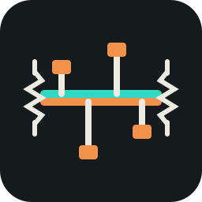
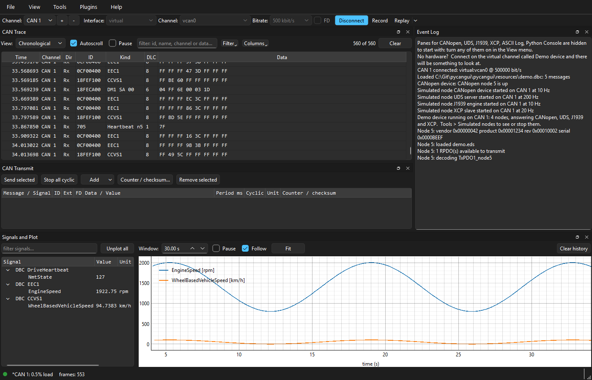

<p align="center">
  
</p>

# pycangui

<!--
The CI and release badges are live. The release badge includes pre-releases, so before the first one it reads "no releases found". The Python and licence badges are checked against pyproject.toml by tests/test_readme.py.
-->

[](https://github.com/davhodg/pycangui/actions/workflows/ci.yml)
[](https://github.com/davhodg/pycangui/releases)


A graphical CAN bus tool: live trace and plots, transmit, CANopen, UDS, J1939, XCP and CCP, and Python scripting, on any adapter supported by python-can. Apache-2.0.



## What it does

- **Live trace** of every connected channel on one clock, CAN FD included, with filtering that hides rather than discards, recording to six log formats, and replay of a log onto a bus.
- **Transmit** raw frames, DBC messages edited by signal, or a CANopen RPDO.
- **CANopen**: node list, object dictionary, PDO configuration, EMCY, LSS, SYNC, DCF save and apply.
- **Custom panes**: the CANopen objects a job needs, laid out as a form with labels and units. Built from the object dictionary with no code, and polled into Signals and Plot.
- **UDS** over ISO-TP: sessions, security access, DIDs, DTCs, routines, and firmware transfer in either direction.
- **J1939**: nodes from address claims, DM1 faults with lamp status and the failure mode in words, multi-packet messages (TP.BAM and TP.CM), requesting and sending PGNs, and SPNs decoded from a J1939 DBC.
- **XCP and CCP on CAN**: connect, seed and key, and reading and writing A2L measurements and characteristics by polling.
- **ASCII Log**: reads any CAN identifier as text, for devices that print a console into the data bytes.
- **Signals and Plot** from DBC decode, CANopen TPDOs or XCP and CCP polling, and out to CSV for whatever you analyse with.
- **Python** hooks with hot reload, replaceable components (your own CAN interface, ISO-TP transport, or XCP or CCP engine), a live console and *Run script*.
- **Plugins** that add a pane of their own, installed from a zip. Three come with pycangui: CANopen firmware download (CiA 302-3), DCF compare, and CiA 402 motor control.
- **Simulated nodes**: devices written as Python files, on a virtual bus or standing on a real adapter, and gateways between channels.
- **Workspaces**: one per product, holding its hooks, EDS files, databases, channels and layout, and exported as one zip.

Full details in [the manual](pycangui/help/manual.md), which is also under **Help > Documentation** in the application.

## Installing

There are three options, and which one you want depends on whether you have Python:

1. **The Windows installer** -- `pycangui-<version>-setup.exe` from the releases page. Nothing else is needed: **not even Python.** It installs a self-contained application, offers a desktop shortcut, and uninstalls cleanly. This is the one to give somebody who wants a CAN tool rather than a Python package.

2. **From the source folder** -- either clone with Git or download as zip, double-click `pycangui.cmd` (Windows) or run `./pycangui.sh` (Linux). Python 3.12 or newer must be on the PATH.

   The first run sets itself up: it creates a *virtual environment* -- a folder called `.venv` holding its own copy of Python and only the libraries pycangui needs, so nothing else on the machine is touched -- and downloads about 90 MB into it. That takes a few minutes once; every later start is immediate, and deleting `.venv` undoes the whole thing. If `uv` is installed it is used instead of pip, which makes rebuilding that folder a matter of seconds.

   The launcher keeps its own `.venv` on purpose and will not use an environment you already have. That is the point of it: it is the way in for somebody who does not want to think about Python environments, and one that sometimes used yours and sometimes did not would be worse than one that never does.

3. **With pip** -- if you already have a Python environment and would rather pycangui went in it, install the wheel and ignore the launcher entirely:

   ```
   pip install pycangui-0.0.1-py3-none-any.whl    # from the releases page
   pycangui                                        # installs a command of that name
   ```

   or from a checkout, `pip install -e .` for the same thing reading the source. Nothing about pycangui needs the launcher: it is an ordinary Python package with an ordinary entry point, and this path leaves the choice of environment to you.

## Supported systems

**Windows and Linux**, on **Python 3.12 or newer**. Both are tested on every push: the newest Python on both, and the oldest supported one on Linux.

**macOS** passes the same tests on Apple silicon and Intel Macs, run for each release, but has not yet been tested on real CAN hardware.

Any adapter [python-can](https://github.com/hardbyte/python-can) supports -- PEAK, IXXAT, Kvaser, Vector, socketcan, the cheap USB dongles and more. The vendor's driver is not bundled: install it and python-can finds it at run time. A `virtual` channel needs no hardware at all.

## Built with

pycangui is Apache-2.0 and is a pure-Python application on top of these packages, each used unmodified under its own licence (licence text as declared in the package metadata). The LGPL components stay separate, replaceable packages, as the LGPL requires.

| Package | Used for | Licence |
|---------|----------|---------|
| [Python](https://www.python.org) | Runtime | PSF-2.0 |
| [PySide6-Essentials](https://www.qt.io/qt-for-python) | GUI toolkit (Qt for Python) | LGPL-3.0 (used under LGPL) |
| [shiboken6](https://www.qt.io/qt-for-python) | Qt binding runtime used by PySide6 | LGPL-3.0 (used under LGPL) |
| [python-can](https://github.com/hardbyte/python-can) | CAN adapter abstraction | LGPL-3.0 |
| [canopen](https://github.com/christiansandberg/canopen) | CANopen protocol stack | MIT |
| [cantools](https://github.com/cantools/cantools) | DBC / KCD / SYM / ARXML decoding | MIT |
| [pyqtgraph](https://www.pyqtgraph.org) | Plotting | MIT |
| [numpy](https://numpy.org) | Numeric arrays for plotting | BSD-3-Clause (with 0BSD / MIT / Zlib / CC0 parts) |
| [python-can-j1939](https://github.com/RaulSMS/python-can-j1939) | J1939 transport and address claim | MIT |
| [pywin32](https://github.com/mhammond/pywin32) | Finding USB2CAN adapters through python-can, on Windows | PSF-2.0 |
| [udsoncan](https://github.com/pylessard/python-udsoncan) | UDS client | MIT |
| [can-isotp](https://github.com/pylessard/python-can-isotp) | ISO-TP transport for UDS | MIT |
| [bincopy](https://github.com/eerimoq/bincopy) | Intel HEX / S-record / binary firmware files | MIT |
| [asammdf](https://github.com/danielhrisca/asammdf) | Reading MDF / MF4 measurement files | LGPL-3.0 |

XCP, CCP and a basic A2L reader are implemented directly in pycangui.

asammdf, the MDF and MF4 reader, is the one **optional** entry: the Windows installer includes it, and a `pip` installation fetches it the first time a measurement file is opened. `pip install pycangui[all]` includes it up front.

Only LGPL Qt modules are used (QtCore, QtGui, QtWidgets). pycangui depends on **PySide6-Essentials** rather than the full PySide6, so the GPL-only add-on modules (Qt Charts, Qt Data Visualization and the rest) are never installed -- which also saves about 160 MB. Adapter drivers (PCAN, Kvaser, Vector, ...) are not included: install the vendor's driver and python-can loads it at run time.

## For development

Working on pycangui needs the same setup as running it from the source folder, plus a few extra Python packages. The launcher already installs pycangui from the source folder in editable mode, so an edit takes effect the next time it starts; all development adds is the `[dev]` extra -- pytest, pytest-xdist, ruff, pdoc and the MDF reader. The launcher leaves those out because running the application does not need them.

After the launcher's first run, add them to its `.venv`:

```
.venv\Scripts\python -m pip install -e .[dev]
```

or, if `uv` was found and created the `.venv` (it has no pip of its own):

```
uv pip install --python .venv\Scripts\python.exe -e .[dev]
```

Without the launcher, `python -m venv .venv` first and then the pip line. Either way, this runs the tests and the linter:

```
.venv\Scripts\python -m pytest -n auto
.venv\Scripts\python -m ruff check .
```

On Linux and macOS the folder is `.venv/bin` rather than `.venv\Scripts`.

`python build/screenshots.py` regenerates `pycangui/help/main-window.png`, the screenshot in this README. It opens pycangui on the demo device for about a minute, with temporary settings of its own, so leave the window alone while it runs.

`python build/api_docs.py` writes API pages for people writing hooks, simulated nodes and plugins to `dist/api-docs/`. Only that surface, not the whole package: the manual says how to extend pycangui, and these pages are where to look up exactly what an object offers.

The suite is a thousand Qt tests and splits cleanly across processes, so `-n auto` runs it in well under a minute rather than six. Leave it off when running a single file: starting the workers costs more than the file does.

## Building the Windows installer

This section is only about making the installer, and most people never need it. To run the latest code, clone the repository and start it with the launcher (option 2 under [Installing](#installing)); to work on it, see [For development](#for-development). Releases are built by CI from a tag, so building locally is for checking the packaging itself.

`build.cmd` produces a self-contained Windows application, and an installer if a compiler for one is present:

```
build.cmd            tests, notices, PyInstaller, checks, then setup.exe
build.cmd nosetup    stop after the checked application folder
```

It runs the tests, regenerates `THIRD-PARTY-NOTICES.txt` from the installed package metadata, builds a **one-directory** bundle with PyInstaller, checks the result, and then wraps it with **Inno Setup**. The result is `dist\pycangui\pycangui.exe` and `dist\pycangui-<version>-setup.exe`; nothing needs to be installed on the target machine, not even Python.

### What the installer includes

**LGPL components are bundled.** Qt (PySide6), python-can and asammdf are all LGPL-3.0 and all ship inside the installer. The LGPL asks that they stay *replaceable*: hence the **one-directory** build, where each is a separate DLL or package a user can substitute their own build of, rather than a single file. Their licences are reproduced in `THIRD-PARTY-NOTICES.txt`, generated from installed package metadata so it cannot drift from what was actually shipped.

**GPL-only components are intentionally excluded.** PySide6 ships Qt Charts, Qt Data Visualization, Qt Graphs and the Virtual Keyboard in the same wheel as the LGPL modules. They are excluded in `pycangui.spec` and `build/check_build.py` fails the build if one appears anyway.

`build/check_build.py` also fails the build if a sample or hook template is missing, or if the built executable cannot import its protocol stacks, the MDF reader and every python-can adapter backend -- it runs `pycangui.exe --selftest` to find out rather than guessing from file names.

Adapter drivers are not bundled: install the vendor's driver and python-can finds it. Hooks, your own components, EDS files and settings stay in `%APPDATA%\pycangui` and survive upgrades and uninstallation.

`.github/workflows/ci.yml` runs the tests and lint on every push: the latest Python on Windows and Linux, and the oldest supported Python on Linux as well, since bugs that only appear on the floor are real but rarely platform specific. The installer is built only for a release -- push a `v*` tag, or start the workflow by hand from the Actions tab -- and `.github/workflows/macos.yml` runs the tests on macOS for each release too.

The version is written once, as `__version__` in `pycangui/__init__.py`. A tag's installer is named after the tag, and the build stops if the tag and `__version__` disagree. Any other build is named `<version>-dev-<commit>`, so an installer that is not a release says so.

## Licence

pycangui is free software, licensed under the Apache License 2.0; see `LICENSE` and `NOTICE`.

The hook and simulated-node templates in `pycangui/hooks` and `pycangui/nodes` are the exception. They are copied into your workspace to be edited, and are released under MIT-0 (`LICENSES/MIT-0.txt`) with no copyright claimed, so what you write in them carries no conditions.

Development has made use of Anthropic's Claude.
